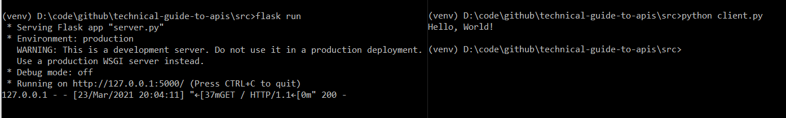
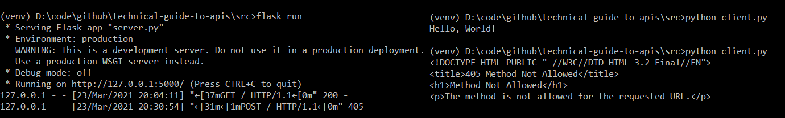
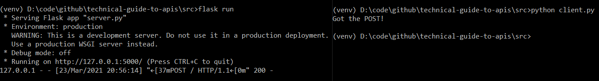
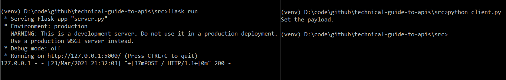
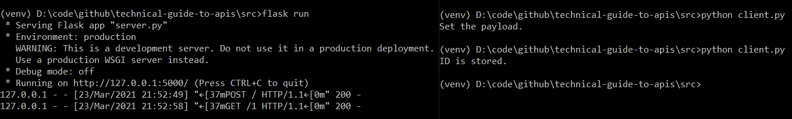

# Technical Guide to APIs
A brief introduction and exploration of APIs using Python's Flask library.
---

**A**pplication **P**rogramming **I**nterfaces are unavoidable in modern software development. After a brief introduction, let's walk through a simple example to gain an intuitive understanding of how they work.

We will be using Python's [Flask](https://flask.palletsprojects.com/en/1.1.x/) library to create our server and Python's [Requests](https://requests.readthedocs.io/en/master/) library to create our client.

## What is an API? Why would someone use one?
APIs are constrained interfaces into an underlying system. They are conceptually similar to an interface from Object Oriented Programming, the primary difference being that APIs are made available for use at runtime. Instead of virtual methods APIs have routes, sometimes called endpoints, which establish a "contract" that certain inputs and outputs will be available.

APIs can be made available to the public on the internet, either truly public or requiring authentication, or they can be kept private to enable communication between disparate software processes on an intranet. By using an API the details of interaction are logically separated from the details of the underyling system.

## Exploring API fundamentals with Flask

Flask is lightweight and unopinionated, making it easy to build APIs in whatever way works best. This is an API tutorial, not a Flask tutorial, so if you want to learn more about Flask see their [installation guide](https://flask.palletsprojects.com/en/1.1.x/installation/#installation) and their [quickstart guide](https://flask.palletsprojects.com/en/1.1.x/quickstart/#quickstart).

A [virtual environment](https://docs.python.org/3/tutorial/venv.html) will be utilized and provided in the repo.

Let's start by defining a single route in `server.py`.

    from flask import Flask
    app = Flask(__name__)

    @app.route('/')
    def hello_world():
        return 'Hello, World!'

As we can see there is one root route, `/`, and when it is called the function `hello_world` executes. It's as simple as it looks.

Let's now create `client.py` and have it call that route. The vast majority of the time [HTTP messages](https://developer.mozilla.org/en-US/docs/Web/HTTP/Messages) are used to communicate via API, which is exactly the purpose of Requests. Note: By default, Flask runs on `localhost:5000`.

    import requests

    r = requests.get('http://localhost:5000')
    print(r.text)

Using requests we send a GET request to `http://localhost:5000`, then print the returned text. It really is that simple.

Let's break down exactly what happened.
1) Requests formed and sent a HTTP GET request to `localhost:5000`.
2) Flask accepted the valid request and returned a HTTP response containing `Hello, World!` and a status code of `200`.
3) `client.py` accepted the valid response and printed the text that was stored by requests in the variable `r`.

If the above makes sense then you understand the most fundamental components of APIs. Congratulations!

### Different HTTP requests

Let's try to send a different type of HTTP request now, for example a POST request. `client.py` now looks like the following:

    import requests

    #r = requests.get('http://localhost:5000')
    payload = {"data": "post_data", "id": 1}
    r = requests.post('http://localhost:5000', data=payload)

    print(r.text)

Let's send it out and see what happens.

As we can see, a `405 Method Not Allowed` HTTP response was returned to our client. This is because Flask routes accept only GET requests by default, and our implementation of the `/` route did not specify that it can handle POST requests.

Let's fix that, and modify the return text in `server.py` so we can see the difference between a GET and a POST.

    from flask import Flask, request
    app = Flask(__name__)

    @app.route('/', methods=['GET', 'POST'])
    def hello_world():
        if request.method == 'POST':
            return 'Got the POST!'
        else:
            return 'Got the GET!'

Now let's try the POST request in `client.py` again.

Incredible! `server.py` was able to accept a POST request and return the appropriate text.

### URL parameters and simple backend logic

API routes offer even more flexibility through URL parameters. Part of the route itself can be converted into a variable. Routes can be extended to include multiple variables or static words through the use of `/`, similar to navigating a file system or website.

Let's rework `server.py` so that POST and GET requests are received by two separate routes, then let's update the GET route to accept an id that we'll set in the POST route. Lastly, we'll update both `server.py` and `client.py` to explicitly use JSON.

`server.py`:

    from flask import Flask, request
    app = Flask(__name__)

    data_from_post = {}

    @app.route('/<id>', methods=['GET'])
    def get_id(id):
        posted_id = data_from_post.get("id")
        if str(posted_id) == str(id):
            return "ID is stored."
        else:
            return "ID not stored."

    @app.route('/', methods=['POST'])
    def post_id():
        global data_from_post
        data_from_post = request.json
        return "Set the payload."

`client.py`:

    import requests

    #r = requests.get('http://localhost:5000')
    payload = {"data": "post_data", "id": 1}
    r = requests.post('http://localhost:5000', json=payload)

    print(r.text)

Let's start up `server.py` and run `client.py` and see what happens.

We appear to have set the payload. Now let's modify `client.py` by uncommenting our original GET request, commenting the POST request, and modifying the GET request to include the expected URL parameter.

`client.py`:

    import requests

    r = requests.get('http://localhost:5000/1')
    #payload = {"data": "post_data", "id": 1}
    #r = requests.post('http://localhost:5000', json=payload)

    print(r.text)

If all goes well we should see "ID is stored." once we kick off the new `client.py`.

We've done it! Our server saved the data from our post and recognized that we passed in the same id during the GET request. It isn't too much of a further leap to imagine storing and querying data from a database.

## Wrap up

If you understand all the above then you understand the fundamental building blocks of APIs. The number of routes can be as many or few as required. Backend logic and URL parameters can be as complex or simple as required. These simple techniques can be expanded to create services such as account authentication, real time data fetching, and even multiplayer games. The sky is the limit!